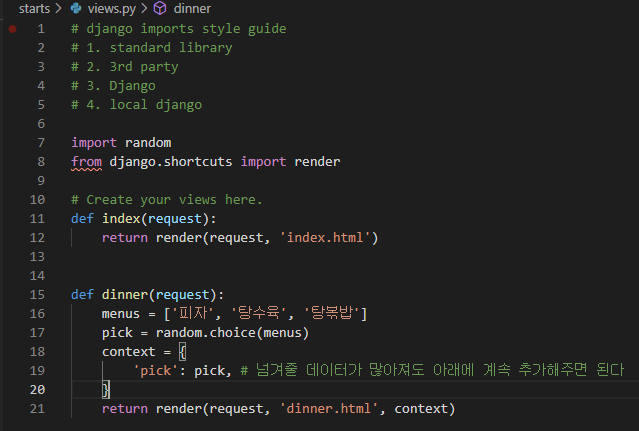

# 처음부터 복습하는 django

### 장고란?

- 파이썬 웹 프레임워크
- 모델-뷰-컨트롤러(MVC)패턴을 따른다.
  - 모델은 애플리케이션의 정보
  - 뷰는 텍스트, 체크박스같은 UI 요소
  - 컨트롤러는 데이터와 비즈니스 로직 사이의 상호동작 관리
- 하지만 장고는 MVC 패턴을 따르지만 MTV 패턴으로 불린다.
  - 기존 MVC 패턴과는 어떻게 비교되는가?
  - MVC의 View와 MTV의 View가 다른 역할을 수행한다는 것에 주의하자!

| MVC 패턴   | Django   |
| ---------- | -------- |
| Model      | Model    |
| View       | Template |
| Controller | View     |


### 시작하기

- 설치

```django
$ pip install django
```

- 특정 버전으로 설치하려면

```django
$ pip install django==version
```

- 잘 설치되었을까?

```django
$ pip list
```

### 프로젝트를 만들자

- Python이나 Django에서 사용하는 이름이나 예약어 등은 사용을 피하자. 하이픈도 사용 불가능!
  - 마지막에 마침표를 붙이면 현재 디렉토리에 생성한다.

```django
$ django-admin startproject projectname [.]
```

### 서버를 실행하자

- 개발 서버는 요청이 들어올 때(코드를 저장했을 때)마다 자동으로 코드를 불러온다.
- 그러므로 코드의 변경사항을 서버에 반영하기 위해 서버를 재가동하는 절차가 필요없다.
  - 다만 모델을 수정하거나, 파일 및 폴더의 변화와 같은 일부 동작은 서버를 재가동해야 한다.

```django
$ python manage.py runserver
```

### 프로젝트는 어떻게 이루어져 있을까?

- `__init__.py`
  - 빈 파일
  - Python에게 이 디렉토리를 하나의 Python 패키지로 다루도록 지시
- `settings.py`
  - 웹사이트의 모든 설정을 포함
  - 우리가 만드는 어떤 application이라도 등록이 되는 곳이며, static files의 위치, database 세부 설정 등이 작성
- `urls.py`
  - 사이트의 url와 view의 연결을 지정
- `wsgi.py`
  - Web Server Gateway Interface
  - 장고 어플리케이션이 웹서버와 연결 및 소통하는 것을 도움
- `asgi.py`
  - new in 3.0
  - Asynchronous Server Gateway Interface
  - 장고 어플리케이션이 비동기식 웹 서버와 연결 및 소통하는 것을 도움

### 어플리케이션도 만들어보자

- 프로젝트 위에서 실제로 어떠한 역할을 하는 것이 app이다.
- 프로젝트는 이러한 어플리케이션들의 집합이고, 실제로 들어오는 요청을 처리하고, 그에 맞는 페이지를 보여주는 등의 역할을 하는 것은 이 어플리케이션들의 역할이다.
- 하나의 프로젝트는 여러 개의 어플리케이션을 가질 수 있다.
  - 어플리케이션은 하나의 역할, 기능 단위로 쪼개는 것이 일반적이다.
  - 그러나 소규모 서비스에서는 이렇게까지 하지는 않는다.
  - 꼭 어떻게 나눠야 한다!같은 기준도 없다.
- 대체로 어플리케이션의 이름은 복수형으로 만들자!!! (articles / accounts같이...)
- 어떻게 만드는가?

```django
$ python manage.py startapp appname
```

### 어플리케이션 안에는 뭐가 있을까?

- `admin.py`
  - 관리자용 페이지 관련 기능을 작성 하는 곳.
- `apps.py`
  - 앱의 정보가 있는 곳. 
  - 우리는 수정할 일이 없다.
- `models.py`
  - 앱에서 사용하는 Model(Database)를 정의하는 곳.
  - MTV중 M을 담당한다.
- `tests.py`
  - 테스트 코드를 작성하는 곳.
- `views.py`
  - view가 정의 되는 곳. 
  - MTV중 V를 담당한다.

### 만든 어플리케이션을 프로젝트에 등록해주자!

- 어플리케이션을 만들면 프로젝트의 `settings.py`의 `INSTALLED_APPS`에 등록을 해줘야 한다.
- 보통 만들어준 앱 - 서드파티 앱 - 장고 앱의 순서대로 만들어주면 좋다.
- 반드시 어플리케이션을 먼저 생성한 후 `settings.py`에 등록해줄 것!
  - 순서를 바꿔 먼저 등록해주고 난 뒤 어플리케이션 생성을 시도하는 경우 만들어지지 않는다.


### Url & Template

- `urls.py`
  - 서버로 요청이 들어오면, 그 요청이 어디로 가는지 인식하고 관련된 함수(View)로 넘겨준다.
  - `views.py`에서 만든 함수를 연결해준다.
  - url의 뒤에는 반드시 `/`가 붙는다. (`'admin/'`, `'index/'` 처럼!)
  - HTTP Request를 받은 urls.py가 어떤 View 함수를 호출할지를 결정하는데,  이 때 path 함수의 두 번째 인자로는 해당 View 함수의 이름을 사용해준다.
    - 여기서는 starts app의 views.py의 함수를 가져온다고 생각해보자.
    - starts의 views.py 안에 있는 특정 함수를 가져올 것이다. 하지만 지금 starts 앱의 views.py는 비어있다. 그렇기에 사용자가 index라는 주소를 요청했을 때 동작을 할 View 함수도 작성해주자.


```python
# urls.py로 요청이 들어오면 path함수가 실행되고, 어떤 view 함수를 호출할지 정한다.
# 위의 사진과, 아래의 예시로 보면 starts 앱의 views.py 안의 index 함수를 실행하게 된다.
urlpatterns = [
	path('admin/', admin.site.urls),
	path('index/', views.index), 
]
```

- `views.py`

```python
def index(request): # 첫 인자는 무조건 request - view 함수는 urls.py로 들어온 요청을 받기에! 
    return render(request, 'index.html') # render의 첫 인자 역시 request 그 뒤는 보여질 문서
```

- request는 요청 간의 모든 정보를 담고 있다.
  - 페이지가 요청되면 Django는 요청에 대한 메타 데이터를 포함하는 HttpRequest 객체를 만들고, url에서 요청에 맞는 view 함수를 호출한 뒤 template을 거쳐 HttpResponse 개체를 반환한다.
- 모델도 생겼고, Views.py도, urls.py도 생겨있는데 템플릿은 자동으로 만들어져있지 않다. 직접 작성해줘야 한다. 만들어진 템플릿이 View 함수로 보내고 그 문서를 요청에 대한 응답으로 보내주게 된다. 

- `Templates`
  - `views.py`에서 지정해준 `index.html`을 만들어보자.
  - 템플릿들이 모이는 폴더의 이름은 반드시 `templates`여야 한다. 
    - 이렇게 해야 장고가 템플릿들을 읽어온다.
    - 장고가 기본으로 인식하는 경로가 있고, 그에 맞춰주어야 한다.
    - 이 templates 폴더 안에 템플릿들을 만든다.
    - 사용자에게 응답으로 HTML 문서가 주어지기 때문에 HTML 파일을 만들어주면 된다.
  - 이 HTML파일들은 어플리케이션 폴더 내부의 templates 폴더 안에 위치하게 된다.
  - `app_name/templates/index.html`
  - 지금까지 살펴본 코드의 작성 순서는 urls.py -> views.py -> templates 이다. 꼭 이 흐름으로 작성해야 하는 것은 아니겠지만 순서가 꼬이게 되면 디버깅할때 어려움을 겪을 수 있다.

### Template Variable

- `render()`를 사용해 views.py에서 정의한 변수를 template 파일로 넘겨 사용한다.
- `render()`의 세 번째 인자로 딕셔너리 형태로 넘겨주고, key에 해당하는 문자열이 template에서 사용할 수 있는 변수명이 된다. 
  - 오른쪽의 값을 사용하기 위해 왼쪽의 키인 'pick'을 이용한다.
  - pick이라는 데이터를 사용하기 위해 문자열 'pick'에 접근하는 것이다.
  - 딕셔너리의 형태에서 키와 값을 맞춰주지 않으면 나중에 헷갈릴 우려가 있다.
  - html상에서 pick을 문자 그대로 사용하면 우리가 원하는 데이터가 반영되지 않고 그냥 문자 pick이 된다.
  - Django HTML의 추가적인 문법이 여기서 사용되게 되는데, 앞서 views.py에서 render()의 3번째 인자였던 context에서 딕셔너리의 key 형태로 넘겨준 문자열을 두 겹의 중괄호 사이에 넣어주면 우리가 원하는 결과를 얻을 수 있다.
  - 넘겨줄 데이터가 한 가지라면 `return render(request, 'dinner.html', {'pick': pick,})`라는 구조가 크게 문제되지 않는다. 하지만 여러 개라면? return render(...... )  모두 다 쓰자니 가독성이 떨어진다.
    - 이런 경우 따로 context라는 변수를 만들어 데이터들을 넣고, render의 인자로는 context를 넘긴다.




### Variable Routing

- 주소 자체를 **변수처럼** 사용해 동적인 주소를 만든다.
  - `path('hello/kim/', views.hello),`라고 함수를 작성했다고 생각해보자. 그러면 kim이라는 단어 외에는 동작하지 않게 된다. 
  - 주소 자체를 변수처럼 사용하고자 한다면 `<str:name>`, `<int:pk>`처럼 사용해주자.

### DTL(Django Templates Language)

- django template에서 사용하는 built-in template system
- 프로그래밍적 로직이 아닌 프레젠테이션을 표현(HTML 코드를 직접 작성하는게 아니라는 것을 의미)
- ``의 모양새를 가지고 있다. 조건, 반복, 치환등의 기능을 가진다.
- 때때로 ``처럼 닫는 태그를 필요로 하는 경우가 있다.(for, if, comment...)
- 조건을 부여할 때 필터를 사용하는 경우가 있다. 
  - `` 과 같이 `|`뒤에 필터링할 조건을 붙인다.

### HTML Form

- Form?
  - 한 페이지에서 다른 페이지로 데이터를 전달하기 위한 목적으로 사용
  - 사용자 정보를 입력받는 여러 방식을 통해 사용자로부터 할당된 데이터를 서버로 전송하는 역할
  - `action`: 입력 데이터가 전송될 URL 지정
  - `method`: 입력 데이터 전달방식 지정
- Input
  - 사용자로부터 데이터를 입력받기 위해 사용한다. form 태그 중 가장 중요함.
  - name 속성
    - 중복 가능하며 form 제출시 name 부분에 설정된 값을 넘겨 값을 가져올 수 있다.
    - GET/POST 방식으로 서버에 전달하는 파라미터이다. 
    - GET
      - 서버로부터 정보 조회시 사용
      - 서버의 데이터, 상태를 변경시켜야 하지 않아야 한다. 
      - 서버에 요청을 보내면 응답으로 HTML 문서가 돌아오는데, 이 때 사용한 요청 방식이 GET 

### URL 분리

- 그 전까지는 프로젝트의 urls.py에서 각 앱의 views.py 내부의 함수에 아래와 같은 방법으로 접근해왔다.


- 하지만 각 앱의 폴더 내부에 urls.py를 따로 만들어주어서 코드의 유지보수를 향상시킬 수 있다.
  - `include()`를 사용하는데, include()를 만나면 URL의 그 시점까지 일치하는 부분을 잘라내고 남은 문자열 부분을 후속 처리를 위해 include된 URL conf로 전달해준다.
  - 아래와 같이 include()를 통해 처리할 수 있다.
  - 이 후에는 기존의 views 내부의 함수들을 각 앱의 urls.py에서 처리해주면 된다.


