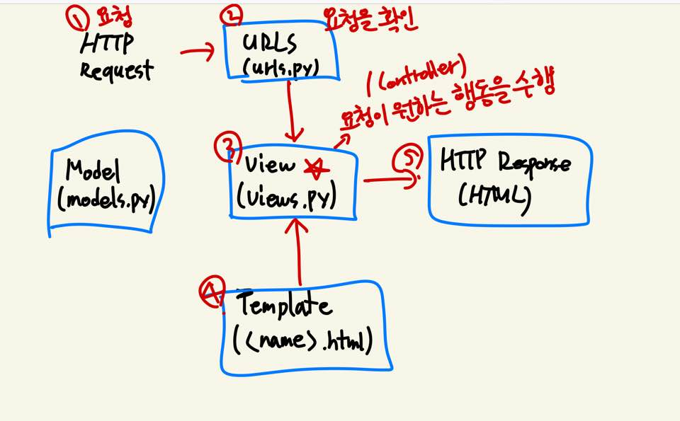

# 처음부터 복습하는 django

### 장고란?

- 파이썬 웹 프레임워크
- 모델-뷰-컨트롤러(MVC)패턴을 따른다.
  - 모델은 애플리케이션의 정보
  - 뷰는 텍스트, 체크박스같은 UI 요소
  - 컨트롤러는 데이터와 비즈니스 로직 사이의 상호동작 관리
- 하지만 장고는 MVC 패턴을 따르지만 MTV 패턴으로 불린다.
  - 기존 MVC 패턴과는 어떻게 비교되는가?
  - MVC의 View와 MTV의 View가 다른 역할을 수행한다는 것에 주의하자!

| MVC 패턴   | Django   |
| ---------- | -------- |
| Model      | Model    |
| View       | Template |
| Controller | View     |



### 시작하기

- 설치

```django
$ pip install django
```

- 특정 버전으로 설치하려면

```django
$ pip install django==version
```

- 잘 설치되었을까?

```django
$ pip list
```

### 프로젝트를 만들자

- Python이나 Django에서 사용하는 이름이나 예약어 등은 사용을 피하자. 하이픈도 사용 불가능!
  - 마지막에 마침표를 붙이면 현재 디렉토리에 생성한다.

```django
$ django-admin startproject projectname [.]
```

### 서버를 실행하자

- 개발 서버는 요청이 들어올 때(코드를 저장했을 때)마다 자동으로 코드를 불러온다.
- 그러므로 코드의 변경사항을 서버에 반영하기 위해 서버를 재가동하는 절차가 필요없다.
  - 다만 모델을 수정하는 등의 일부 동작은 서버를 재가동해야 한다.

```django
$ python manage.py runserver
```

### 프로젝트는 어떻게 이루어져 있을까?

- `__init__.py`
  - 빈 파일
  - Python에게 이 디렉토리를 하나의 Python 패키지로 다루도록 지시
- `settings.py`
  - 웹사이트의 모든 설정을 포함
  - 우리가 만드는 어떤 application이라도 등록이 되는 곳이며, static files의 위치, database 세부 설정 등이 작성
- `urls.py`
  - 사이트의 url와 view의 연결을 지정
- `wsgi.py`
  - Web Server Gateway Interface
  - 장고 어플리케이션이 웹서버와 연결 및 소통하는 것을 도움
- `asgi.py`
  - new in 3.0
  - Asynchronous Server Gateway Interface
  - 장고 어플리케이션이 비동기식 웹 서버와 연결 및 소통하는 것을 도움

### 어플리케이션도 만들어보자

- 프로젝트 위에서 실제로 어떠한 역할을 하는 것이 app이다.
- 프로젝트는 이러한 어플리케이션들의 집합이고, 실제로 들어오는 요청을 처리하고, 그에 맞는 페이지를 보여주는 등의 역할을 하는 것은 이 어플리케이션들의 역할이다.
- 하나의 프로젝트는 여러 개의 어플리케이션을 가질 수 있다.
  - 어플리케이션은 하나의 역할, 기능 단위로 쪼개는 것이 일반적이다.
  - 그러나 소규모 서비스에서는 이렇게까지 하지는 않는다.
  - 꼭 어떻게 나눠야 한다!같은 기준도 없다.
- 대체로 어플리케이션의 이름은 복수형으로 만들자!!! (articles / accounts같이...)
- 어떻게 만드는가?

```django
$ python manage.py startapp appname
```

### 어플리케이션 안에는 뭐가 있을까?

- `admin.py`
  - 관리자용 페이지 관련 기능을 작성 하는 곳.
- `apps.py`
  - 앱의 정보가 있는 곳. 
  - 우리는 수정할 일이 없다.
- `models.py`
  - 앱에서 사용하는 Model(Database)를 정의하는 곳.
- `tests.py`
  - 테스트 코드를 작성하는 곳.
- `views.py`
  - view가 정의 되는 곳. 

### 만든 어플리케이션을 프로젝트에 등록해주자!

- 어플리케이션을 만들면 프로젝트의 `settings.py`의 `INSTALLED_APPS`에 등록을 해줘야 한다.
- 보통 만들어준 앱 - 서드파티 앱 - 장고 앱의 순서대로 만들어주면 좋다.

### Url & Template

- `urls.py`
  - 서버로 요청이 들어오면, 그 요청이 어디로 가는지 인식하고 관련된 함수(View)로 넘겨준다.
  - `views.py`에서 만든 함수를 연결해준다.

```python
urlpatterns = [
	path('admin/', admin.site.urls),
	path('index/', views.index),
]
```

- `views.py`

```python
def index(request): # 첫 인자는 무조건 request
    return render(request, 'index.html') # render의 첫 인자 역시 request
```

- `Templates`
  - `views.py`에서 지정해준 `index.html`을 만들어보자.
  - 이 HTML파일들은 어플리케이션 폴더 내부의 templates 폴더 안에 위치하게 된다.
  - `app_name/templates/index.html`

