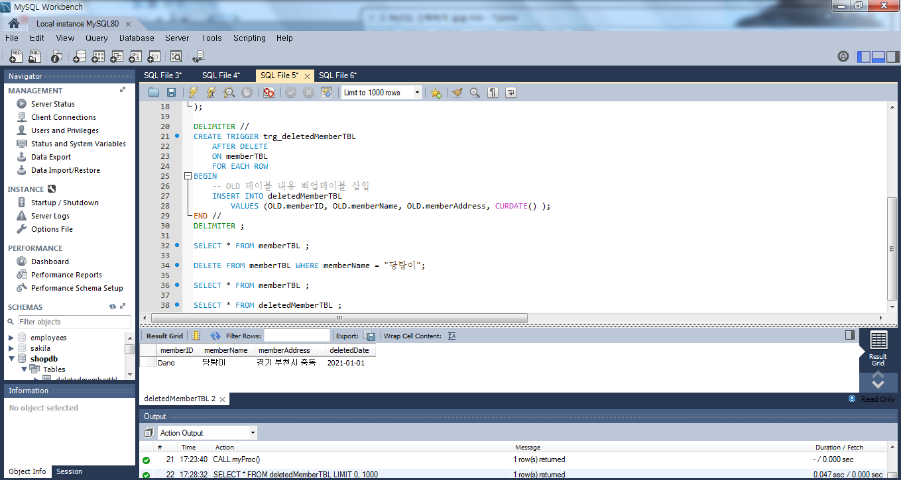

# 2. MySQL 간략하게 실습

### 요구사항 분석, 시스템 설계, 모델링

- 정보 시스템 구축의 5단계: `분석 - 설계 - 구현 - 시험 - 유지보수`
  - 분석
    - 시스템 분석, 요구사항 분석이라고 부르며 현재 우리가 **무엇을** 할 것인지를 결정한다. 
    - 첫 단계이므로 많은 시간을 투자해야 하며 분석의 결과로 많은 문서를 작성해야 한다.
  - 설계
    - 시스템 설계, 프로그램 설계라고 부르며 구축하려는 시스템을 **어떻게** 할 것인지를 결정
    - 시스템 설계가 끝나면 그 결과 문서들을 프로그래머에게 전해 프로그래머가 설계서에 나온 그대로 프로그램을 작성한다.
    - 시스템 설계가 끝나면 가장 큰 작업이 끝난 것으로 간주한다. 분석과 설계의 과정이 전체 과정의 절반 가까이를 차지한다.
  
- 데이터베이스 모델링
  - 분석, 설계 과정에서 가장 중요한 것 중 하나가 데이터베이스 모델링이다.
    - 데이터베이스 모델링은 현실의 데이터를 MySQL에 어떻게 옮길지를 결정하는 과정이다.
    - 저장할 정보는 단편적인 형태가 아닌 테이블이라는 형식에 맞추어야 한다.
  
  
  
  - 용어
    - 데이터: 컴퓨터, 삼성 등과 같은 하나하나의 단편적인 정보를 의미한다. 정보는 있으나, 아직 체계화되지 못한 상태를 뜻한다.
    - 테이블: 데이터를 입력하기 위해 표 형태로 표현한 것이다. 
    - 데이터베이스: 테이블이 저장되는 저장소를 의미한다. 각 데이터베이스는 서로 다른 고유한 이름을 가져야 한다.
    - 열(컬럼, 필드): 각 테이블은 열로 구성된다. 
    - 열 이름: 각 열을 구분하기 위한 이름이다.열 이름은 각 테이블 안에서는 중복되지 않는 고유한 값이어야 한다.
    - 데이터 형식: 열의 데이터 형식을 뜻한다. 이러한 데이터 형식은 테이블 생성 시 열 이름과 함께 지정해주어야 한다. 
    - 행(로우, 레코드): 실질적인 데이터를 의미한다. 
    - 기본 키 열: 각 행을 구분하는 유일한 열을 의미한다. 기본 키 열은 중복되어서는 안되며, 비어 있어도 안된다. 각 테이블에는 기본 키가 하나만 지정되어있어야 한다. 
    - 외래 키 필드: 두 테이블의 관계를 맺어주는 키를 말한다. 

### MySQL을 이용한 데이터베이스 구축 절차


- 데이터베이스 생성
  - 쿼리 창: 쿼리(SQL)을 직접 입력하는 곳
  - 쿼리 실행 버튼: 쿼리 창에 입력된 쿼리문을 실행한다. 왼쪽은 선택된 부분이나 전체를 실행하고, 오른쪽은 커서가 있는 행만 실행한다.
  - 결과 메시지 창: 쿼리가 정상 실행되거나 오류가 난 경우 결과 메시지가 나온다.
  - 데이터 개수: 쿼리의 수행 결과로 몇 건의 데이터가 조회되었는지 개수를 보여준다.
  - 쿼리 수행 시간: SQL을 수행해 결과가 나오기까지 소요된 시간을 보여준다.
  - 서버 관리 창: 서버의 상태 등을 관리할 수 있는 기능들을 보여준다.
  - 데이터베이스 목록 창: MySQL 내부의 데이터베이스 목록과 내부 테이블을 보여준다. 더블클릭하면 해당 데이터베이스가 선택되고 굵은 폰트로 보여진다.
  - `CREATE SCHEMA 'db 이름'`
    - MySQL에서는 SCHEMA와 데이터베이스를 동일한 용어로 사용한다!
  - 아무것도 들어있지 않은 데이터베이스가 생성된다.
- 테이블 생성
  - 테이블의 생성 이전에 각 열의 영문 이름과 데이터 형식을 결정하여야 한다.
    - 원래는 물리적 데이터베이스 모델링 과정에서 해당 과정을 결정한다.
    - 개체(데이터베이스, 테이블, 열) 이름은 영문으로 해야 한다. 행 데이터의 값(실제 데이터)만 한글을 사용해야 한다. 개체 이름을 한글로 해버리면 호환성의 문제가 생긴다.

```mysql
CREATE TABLE 'shopdb'.'memberTBL' (
    'memberID' CHAR(8) NOT NULL,
    'memberName' CHAR(5) NOT NULL,
    'memberAddress' CHAR(20) NULL,
    PRIMARY KEY ('memberID'));
```

| 열 이름(한글) | 영문 이름     | 데이터 형식 | 길이         | NULL 여부 |
| ------------- | ------------- | ----------- | ------------ | --------- |
| 아이디        | memberID      | 문자(CHAR)  | 8글자(영문)  | X         |
| 회원 이름     | memberName    | 문자(CHAR)  | 5글자(한글)  | X         |
| 주소          | memberAddress | 문자(CHAR)  | 20글자(한글) | O         |

- 데이터 입력
  - `INSERT INTO 테이블 VALUES ('넣어줄 값들');`
  - 삭제하려면 `DELETE FROM 테이블 이름 WHERE 조건;`
- 데이터 활용
  - 테이블의 모든 데이터 조회: `SELECT * FROM 테이블;`
  - 테이블의 특정 데이터 조회: `SELECT 조회할 열 이름 FROM 테이블`;
  - 특정 조건에 부합하는 모든 데이터 조회: `SELECT * FROM 테이블 WHERE 조건;`
    - `*`는 모든 열을 의미한다.
    - 세미콜론은 없어도 무관하지만, 워크벤치가 아닌 명령어 모드에서는 반드시 필요하다.
  - 테이블 생성: `CREATE TABLE 테이블 이름 (id INT);`
    - 테이블 등을 생성하고 바로 확인하려면 개체 그룹을 선택하고 Refresh All을 누르자!
  - 테이블 삭제: `DROP TABLE 테이블 이름;`
  - SQL은 대소문자를 구분하지 않지만 예약어는 대문자로 작성해준다.
  - 중간에 공백이 있는 개체의 이름을 사용할 때는 백틱으로 묶어야 하나의 이름으로 인식한다.
  - `--`하이픈 2개를 앞에 붙이면 주석으로 인식하는데, 하이픈 뒤에 공백을 하나 줘야한다.
  - 쿼리 창에서 그냥 실행하면 그 쿼리 창에 있는 모든 SQL문을 다 수행하기에 데이터를 변경하거나, 삭제하는 SQL문을 사용했거나 코드가 길고 복잡할 경우 문제가 발생할 수 있다.
    - 실행할 부분만 드래그해서 실행하는 등의 방법으로 문제를 방지할 수 있다.

### 테이블 외의 데이터베이스 개체 활용

- 인덱스
  
  
  
  
  
  - 데이터가 방대해질수록 특정 데이터를 조회하는 데 더 오랜 시간이 걸리게 되는데, 인덱스를 활용하면 데이터를 훨씬 빠르게 조회할 수 있다.
    - 인덱스 등을 활용해 데이터베이스 성능을 향상시키거나 응답 시간을 단축시키는 것을 데이터베이스 튜닝이라고 한다.
  - 인덱스는 테이블의 열 단위에 생성되며 열을 기본 키로 설정하면 자동으로 인덱스가 생성된다.
  - 인덱스가 없을 때 데이터를 조회하면 MySQL의 Execution Plan에서 `Full Table Scan`으로 테이블 전체를 검색했다는 것을 알 수 있다.
  - 인덱스를 만든 후 동일한 내용을 조회하면 이번에는 `Non-Unique Key Lookup`이라고 바뀌어있는 것을 알 수 있다. (인덱스를 사용했다는 의미)

```mysql
CREATE TABLE indexTBL (
	first_name varchar(14),
    last_name varchar(16),
    hire_date date);
INSERT INTO indexTBL
	SELECT first_name, last_name, hire_date
	FROM employees.employees
	LIMIT 500;
    
SELECT * FROM indexTBL;

SELECT * FROM indexTBL WHERE first_name = "Mary";

CREATE INDEX idx_indexTBL_firstname ON indexTBL(first_name);
```

- 뷰

  
  
  - 가상의 테이블! 테이블처럼 보이지만 테이블은 아니다!
    - 테이블과 동일하게 보이지만, 뷰는 실제 행 데이터를 가지고 있지 않다. 
    - 실체가 없으며, 진짜 테이블에 링크된 개념
    - 그렇기에 뷰를 SELECT하면 진짜 테이블의 데이터를 조회하는 것과 동일한 결과가 된다.

```mysql
CREATE VIEW uv_memberTBL
AS SELECT memberID, memberAddress FROM memberTBL;

SELECT * FROM uv_memberTBL;
```

- 스토어드 프로시저

  

  - MySQL에서 제공해주는 프로그래밍 기능
    - SQL문을 하나로 묶어서 편리하게 사용하는 기능
    - SQL문(주로 SELECT문)을 매번 하나씩 수행하기보다는 스토어드 프로시저로 만든 뒤 스토어드 프로시저를 호출하는 식으로 많이 활용하게 된다.
  - `DELIMITER`는 구분 문자를 의미한다!
    - 기존의 세미콜론을 `//`로 대신한다는 의미를 가지고 있다.
    - `CREATE PROCEDURE ~ END`까지를 하나의 단락으로 묶어주는 효과를 가진다.
    - 가장 마지막 행에서 세미콜론으로 돌려놓아야 한다.
  - 스토어드 프로시저는 `CALL 스토어드 프로시저_이름()`으로 실행한다.
    - 데이터베이스 개체를 만들기 위해서는 **CREATE 개체종류 개체이름**
    - 데이터베이스 개체를 삭제하기 위해서는 **DROP 개체종류 개체이름**
    - `DROP PROCEDURE 프로시저 이름`이라고 하면 해당 스토어드 프로시저를 삭제한다.

```mysql
SELECT * FROM memberTBL WHERE memberName = "당탕이" ;
SELECT * FROM productTBL WHERE productName = "냉장고" ;

DELIMITER //
CREATE PROCEDURE myProc()
BEGIN
	SELECT * FROM memberTBL WHERE memberName = "당탕이" ;
	SELECT * FROM productTBL WHERE productName = "냉장고" ;
END //
DELIMITER ;

CALL myProc() ;

```

- 트리거

  

  - 테이블에 부착되어서 테이블에 INSERT나 UPDATE, DELETE 작업이 발생하면 실행되는 코드를 의미한다.
  - 테이블에 삭제, 삽입같은 특정 작업이 일어날 경우 작업이 일어나기 전 미리 다른 곳에 데이터를 **자동으로** 저장해주는 기능
  - 예시
    - 회원 테이블에 새 정보를 입력하고 데이터가 잘 입력되었는지 확인한 후 삭제한다.
    - 이 때 삭제된 회원이 이전에 회원이었다는 정보가 남지 않게 되는 문제가 생긴다.
    - 이럴 때 트리거를 활용할 수 있다.

```mysql
INSERT INTO memberTBL VALUES ('figure', '연아', '경기도 군포시 당정동');

SELECT * FROM memberTBL ;

UPDATE memberTBL SET memberAddress = "서울 강남구 역삼동" WHERE memberName = "연아";

SELECT * FROM memberTBL ;

DELETE FROM memberTBL WHERE memberName = "연아";

SELECT * FROM memberTBL ;

CREATE TABLE deletedMemberTBL ( -- 지워진 데이터를 보관할 테이블
	memberID CHAR(8) ,
    memberName CHAR(5) ,
    memberAddress CHAR(20) ,
    deletedDate DATE -- 삭제한 날짜
);
    
-- 회원 테이블에 DELETE 작업이 일어나면 백업테이블(deleted..TBL)에 지워진 데이터가 기록되는 트리거

DELIMITER //
CREATE TRIGGER trg_deletedMemberTBL -- 트리거의 이름
	AFTER DELETE -- 삭제 후에 작동하게 지정
    ON memberTBL -- 트리거를 부착할 테이블
    FOR EACH ROW -- 각 행마다 적용시킴
BEGIN
	-- OLD 테이블 내용 백업테이블 삽입
    INSERT INTO deletedMemberTBL
		VALUES (OLD.memberID, OLD.memberName, OLD.memberAddress, CURDATE() );
END //
DELIMITER ;

SELECT * FROM memberTBL ;

DELETE FROM memberTBL WHERE memberName = "당탕이";

SELECT * FROM memberTBL ;

SELECT * FROM deletedMemberTBL ;
```

