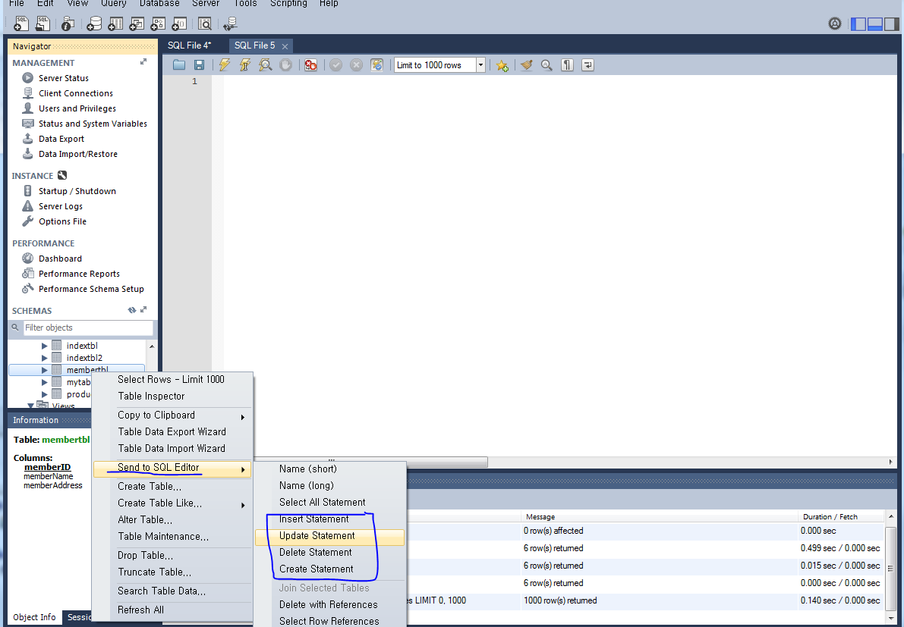
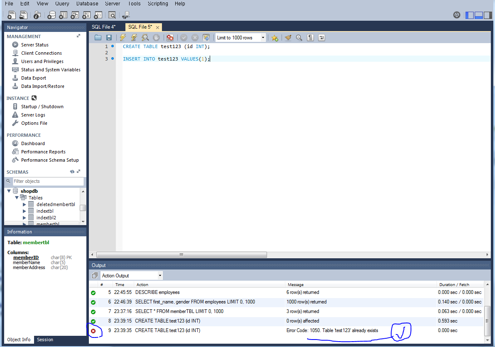

# 4. MySQL 유틸리티

### 워크벤치

- 주요 기능
  - 데이터베이스 연결 기능
  - 인스턴스 관리
  - 위저드를 이용한 MySQL의 동작
  - 통합된 기능의 SQL 편집기
  - 데이터베이스 모델링 기능
  - 포워드 / 리버스 엔지니어링 기능
  - 데이터베이스 인스턴스 시작 / 종료
  - 데이터베이스 내보내기 / 가져오기
  - 데이터베이스 계정 관리
- 특별한 경우가 아니라면 MySQL의 포트 번호는 3306이다.
  - 보안을 위해 서버 컴퓨터에서 포트를 변경할 수도 있다.

- Hostname의 localhost나 127.0.0.1은 자신의 컴퓨터(MySQL이 설치된)를 의미한다.

- 네비게이터

  - MySQL의 관리, 운영을 위한 도구이다. 
  - MySQL의 여러 작업을 네비게이터를 통해 수행할 수 있고,  SQL문을 잘 모르더라도 많은 작업을 수행할 수 있다.
    - SQL 구문을 몰라도 쿼리를 작성할 수 있다.

  

  - 스키마 탭
    - 데이터베이스 생성 및 삭제
    - 데이터베이스 개체(테이블, 뷰, 스토어드 프로시저, 인덱스 등)의 생성 및 관리
    - 데이터베이스의 속성을 조회
  - 관리 탭
    - management	
      - MySQL 서버의 가동 상태, 설치된 폴더 확인
        - 현재 서버의 가동 상태, 포트, 환경 파일의 경로, 메모리 상태 및 CPU 사용 상태
      - MySQL 서버에 연결되어 있는 클라이언트 정보 확인
        - kill connection을 통해 클라이언트의 연결을 끊을 수도 있다.
      - 사용자의 생성, 삭제 및 권한 관리
      - 서버 변숫값 확인
        - MySQL 서버에 설정된 시스템 변수들을 확인하고 값을 변경할 수 있다.
      - 데이터 내보내기 / 가져오기
        - 백업, 복원과 연관
    - instance
    - 인스턴스는 MySQL 서버가 메모리상에서 실행중인 상태를 지칭한다. MySQL 서버는 하드에 설치된 프로그램을 말하며, MySQL 인스턴스는 프로그램이 컴퓨터에서 백그라운드로 서비스를 제공중인 상태를 말한다. 보통 같은 것으로 취급해도 문제는 없다.
      - MySQL 연결 정보 관리
      - MySQL 서버의 작동 상태 확인, 서버의 중지와 시작
      - 서버에 기록된 오류, 경고 등의 로그 조회
      - MySQL 옵션 파일의 설정 정보 확인 및 변경
        - 핵심 설정 파일인 my.ini 파일의 내용을 GUI 모드로 보여준다.
    - performance
      - 네트워크 상태 및 MySQL의 성능 상태를 확인
      - 성능 상태의 보고서 작성
        - 입출력이 오래 걸린 파일, 비용이 많이 든 쿼리, 데이터베이스 통계 조회 가능
      - 성능 구성의 설정

- 쿼리 창
  - 쿼리 문장(SQL 구문)을 입력하고 실행하는 텍스트 에디터
  - 각 SQL문의 끝에 세미콜론을 써줘야 문장의 끝으로 인식한다. 
    - 세미콜론이 없다면 문장의 끝이 아니라 인식하기에 줄 바꿈이 가능해진다.
  - 네비게이터에서 데이터베이스를 클릭한 뒤 드래그하면 글자가 자동으로 완성된다.
  - 행 데이터가 많을 경우 쿼리의 결과는 1000개까지 출력되도록 설정되어 있다.
    - 이는 SELECT문의 제일 뒤에 `LIMIT 0. 1000`이 붙은 것과 동일하다. 0번째 행부터 1000번째 행까지 출력된다는 것이다.
    - 출력될 개수를 조정할 수 있다.
  - 쿼리 창은 첫 문장부터 실행한다.
    - 이미 실행된 CREATE문 등이 위에 남아있는 경우 오류 메시지를 출력하게 된다.
      - 쿼리가 정상적으로 실행되었다면 해당 구문을 지우거나, 실행하기를 원하는 구문만 드래그에 실행함으로 해결할 수 있다.

### 사용자 관리

- 실무에서 기본 값인 root로 접속하는 것은 바람직하지 않다!
  - root 사용자는 MySQL의 모든 작업을 할 수 있다. 그렇기에 암호 유출시 큰 문제가 된다.
  - 그렇기에 일반 사용자를 생성하고 각 사용자에 적합한 권한을 부여해야 한다.
    - 네비게이터 - administration - user and privileges 탭에서 권한 부여가 가능하다.
    - 명령어 모드에서 SQL문으로 권한 부여가 가능하지만 동일한 작업을 워크벤치에서 조금 더 편리하게 할 수 있다.
    - 각 사용자에게 MySQL 자체에 대한 권한을 설정하거나, 각각의 데이터베이스에 다른 권한을 부여할 수 있다.(어떤 DB에는 SELECT만, 다른 DB에서는 INSERT, UPDATE..)
    - 사용자가 자신에게 부여되지 않은 권한을 쿼리 창에서 실행하면 오류 메시지를 출력한다.